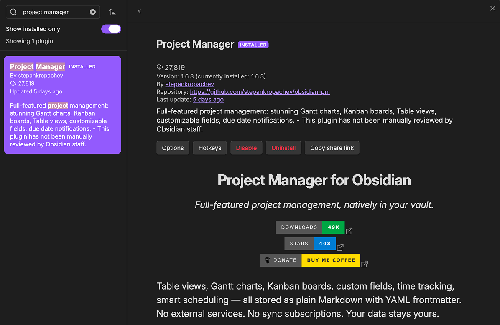

# Install

dotpm is a community plugin — listed in Obsidian's plugin browser under its original name, **Project Manager**. Install it from inside Obsidian Community Plugin.

## Install from community plugins

1. Open Obsidian → **Settings** → **Community plugins**.
2. If you haven't already, turn off restricted mode.
3. Click **Browse** and search **Project Manager**.
4. Click **Install**, then **Enable**.

## What changes after install

- A new ribbon icon appears on the left sidebar: a small gantt chart symbol labeled **Project manager**. Click it to open the project list.
- The command palette gains a handful of commands (search "Project Manager"):
  - **Open projects pane**
  - **Create new project**
  - **Create new task**
  - **Create new subtask**
  - **Open all projects in one view**
  - **Import notes as tasks**
  - **Create task from selection**
  - **Open current file as project**
  - **Archive completed tasks**
  - **Rebuild project index**
  - **Show tasks assigned to a person**
  - **Show tasks assigned to this note**
  - **Link assignees to their person notes**
  - **Undo last action**
  - **Redo last action**
- A new settings section appears under **Settings** → **Project Manager** (see [Settings reference](12-settings-reference.md)).

## Where to go next

- [Create a project](02-first-project.md) — open the project list and create something to work in.
- [Vault layout](04-vault-layout.md) — where files end up on disk.
- [Importing existing notes](19-importing-notes.md) — bring notes you already have into a project.

## Tips

> dotpm only touches files you point it at. It writes inside project folders, and outside them only when you run an import — which tells you first whether it's moving your notes or copying them.
