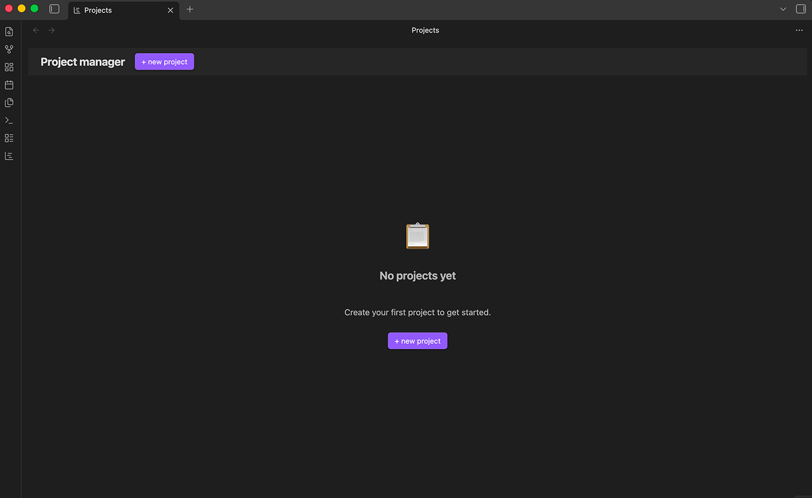
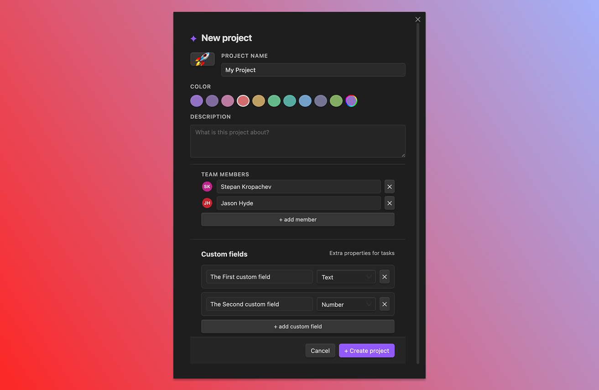

# Create your first project

A project is a container for tasks, custom fields, saved views, and the team members assigned to that work. Each project is a single markdown file in your vault.

> [GIF: ribbon icon → project list → "+ new project" → modal → file appears in the file explorer.]

## Open the project list

Click the **Project manager** ribbon icon, or run **Open projects pane** from the command palette. The project list opens in a new tab.

If you have no projects yet, the list is empty with a single **+ new project** button.

## Create a project

1. Click **+ new project** (or run **Create new project** from the command palette).
2. In the modal, enter a **title**.
3. Pick an **icon** (emoji) and a **color**. These show up in the project list and headers.
4. Click **Create**.

The project opens in its default view (table, by default — see [Settings reference](12-settings-reference.md) to change this).

## What was created on disk

A single markdown file: `Projects/<Title>.md`.

Inside the file:

- YAML frontmatter with `pm-project: true` and the project's metadata.
- A heading with the icon and title.
- A `## Tasks` section that the plugin keeps in sync as you add tasks.

The `Projects/` folder is auto-created if it doesn't exist. You can change its location under **Settings** → **Project Manager** → **Projects folder**.

A second folder named `<Title>_tasks/` is created the first time you add a task to this project (not before).

## Where to go next

- [Create your first task](03-first-task.md) — add work to the project.
- [Vault layout](04-vault-layout.md) — understand where everything lives.
- [Importing existing notes](19-importing-notes.md) — turn notes you already have into tasks.

## Tips

> A project is just a markdown file. You can move it, rename it (rename the file *and* the matching `_tasks/` folder), or version it with git. The plugin reads the file on next load.

> Want to start from an existing note? See [Importing existing notes](19-importing-notes.md) — you can pull notes in as **tasks** with the import command, or convert a note into a **project** by adding the `pm-project: true` marker yourself.
