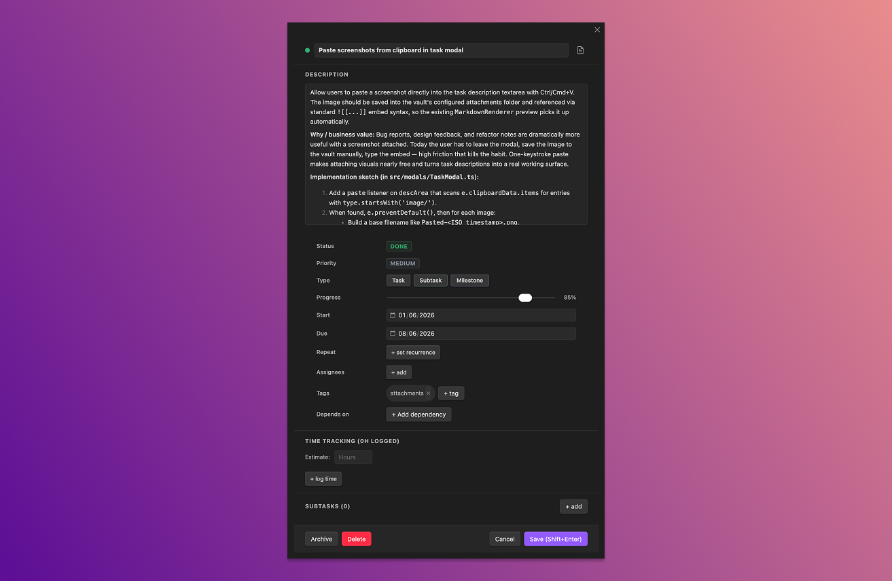
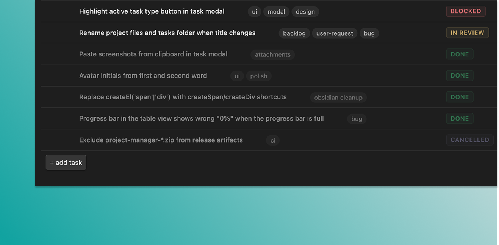

# Create your first task

A task is a single unit of work. It lives in its own markdown file inside the project's `_tasks/` folder.

> [GIF: quick-add bar → type title → enter → row appears → click to open modal.]

## How to add a task

### Task modal

1. Click **+ new task** from the toolbar, or run **Create new task** from the command palette.
2. Fill in any fields you need:
   - **Title** (required).
   - **Status** — see [Statuses and priorities](06-statuses-and-priorities.md).
   - **Priority** — critical, high, medium, or low.
   - **Start** and **Due** — `YYYY-MM-DD`, both optional.
   - **Assignees** — picked from the project's team plus the global list.
   - **Tags** — free-form labels for filtering.
   - **Description** — free-form notes (markdown).
   - **Type** — task or milestone. A milestone has a single date and renders as a diamond in the gantt view.
3. Save: click **Save**, or press **Shift+Enter** anywhere in the modal.

### Inline edit

In the table view, click any editable cell (status, priority, dates, title) to edit in place. Press **Enter** to commit, **Escape** to cancel.

## Saving — and "save on close"

By default, closing the task modal saves your changes. To require an explicit save instead, turn off **Save tasks on close** under **Settings** → **Project Manager**.

## What was created on disk

A markdown file at `Projects/<Project>_tasks/<slug>.md`, where `<slug>` is the task title — lowercased, spaces become hyphens, max 40 characters.

Example: a task titled "Write release notes" gets a filename like `write-release-notes.md`.

If another task in the same project already uses that filename, the title input shows an inline error and the task won't save until you pick a different title.

> Tasks created in earlier versions keep their `<slug>-<id>.md` filenames until you rename the title or the file yourself.

The file's YAML frontmatter holds every field you can set on a task. The markdown body is the task's description.

See [Data format](17-data-format.md) for the full schema.

## Where to go next

- [Table view](09-table-view.md) — filter, sort, and edit tasks in bulk.
- [Statuses and priorities](06-statuses-and-priorities.md) — customize the workflow.
- [Subtasks and dependencies](07-subtasks-and-dependencies.md) — break work down and link blockers.

## Tips

> Quick-add gives you a sensible default task in one keystroke. Use it for capture, then open the modal later to fill in the rest.

> If you want to create a subtask of a specific task, run **Create new subtask** from the command palette — it'll prompt you for the parent.
