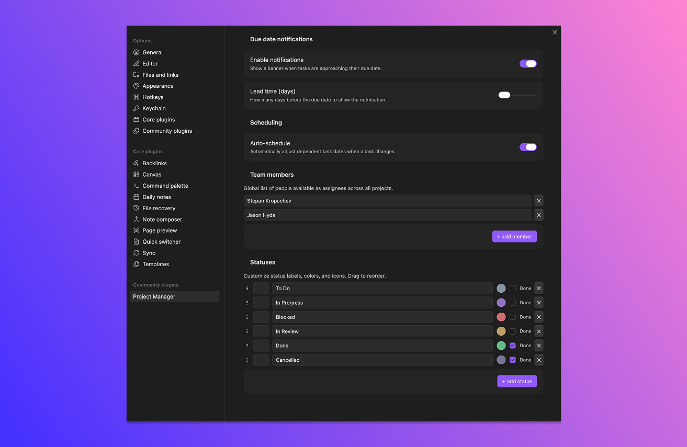

# Statuses and priorities

Statuses are fully customizable per vault. Priorities are a fixed set. Both are used everywhere — filters, sort order, kanban columns, the gantt left panel.

## Default statuses

| ID | Label | Marked as "done" |
| --- | --- | --- |
| `todo` | To do | no |
| `in-progress` | In progress | no |
| `blocked` | Blocked | no |
| `review` | In review | no |
| `done` | Done | yes |
| `cancelled` | Cancelled | yes |

Each status has a label, a color (used for badges and the kanban column header), an optional icon, and a **complete** flag.

The complete flag matters for two behaviors:

- **Notifications** are suppressed for tasks whose status is marked complete.
- **Auto-schedule** ignores tasks whose status is marked complete when shifting dependent dates.

That's it. Status IDs themselves aren't special — the plugin doesn't hard-code "done" anywhere. The "done" *flag* is what counts.

## Customize statuses

Under **Settings** → **Project Manager** → **Statuses**:

1. **Reorder** by dragging the handle on the left. Order in this list = order in kanban columns and the table view's status sort.
2. **Edit** the label, icon, or color by clicking on the row.
3. **Toggle the "complete" flag** for any status.
4. **Delete** a status with the trash icon.
5. **Add** a new status with **+ add status**.

## What happens when you delete a status

Tasks that were using the deleted status get remapped to the first status in the list. The mapping is automatic — no prompt, no migration step.

If you want to keep history clean, change those tasks' status manually *before* deleting.

## Priorities

Priorities are a fixed set: **critical**, **high**, **medium**, **low**. You can't add, remove, or rename them in the current version.

Why fixed? They're used for the priority color rail on kanban cards and a few small UI affordances that depend on having a known set. Status is the open-ended customization point.

Priorities have:

- A **label** and a **color** (currently not user-editable in the UI).
- A position in the sort order: critical → high → medium → low.

## Where to go next

- [Kanban view](11-kanban-view.md) — one column per status.
- [Settings reference](12-settings-reference.md) — the full status editor.

## Tips

> Keep the status list short. Five to seven is plenty. Long status lists mean long kanban scrolls and harder filtering.

> If you want a "won't fix" or "deferred" outcome, add a status with the "done" flag turned on. It'll behave like done for notifications and scheduling, without using the literal "Done" label.
