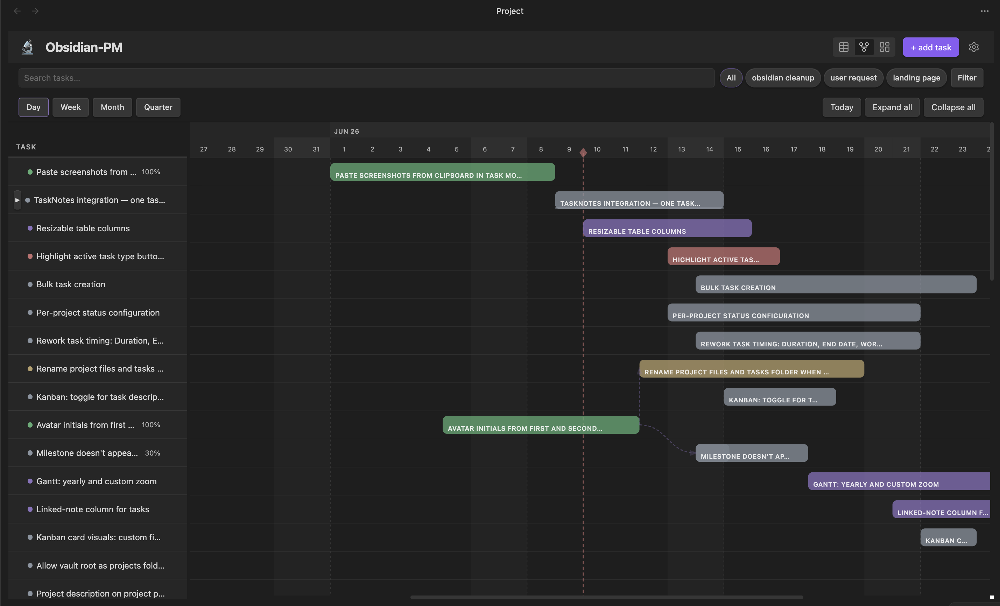
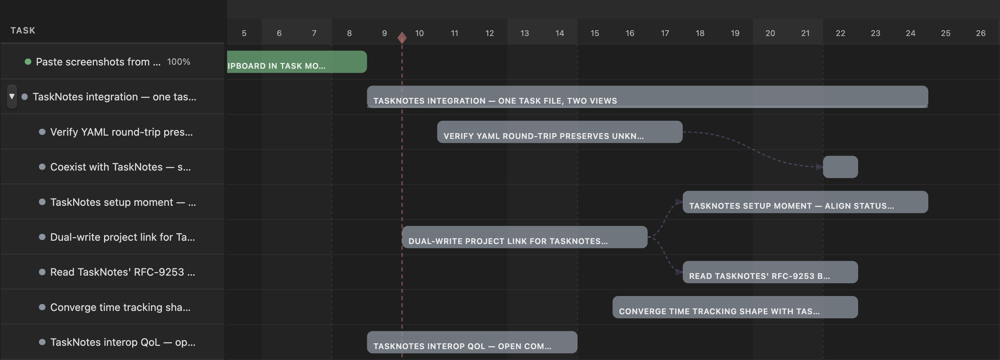

# Gantt view

The gantt view is for *planning*. See start and due dates as bars on a timeline. Drag to reschedule. Watch dependencies as arrows between bars. Switch zoom levels from day to quarter.

> [Video, 30–60s: open populated gantt → drag a bar to move → resize a bar → switch day / week / month / quarter → show a dependency line → click a bar to open modal.]

## Anatomy

Left panel: the task list, mirroring the table's row order, indented by parent.

Right panel: the timeline. Each task is a horizontal bar from its start to its due date. Milestones are diamonds.

A vertical divider between the two is draggable — drag to resize the left panel.

## Granularity (zoom)

Four levels, switched via the toolbar:

- **Day** — one cell per day.
- **Week** — one cell per week. The header label format is configurable — see below.
- **Month** — month columns.
- **Quarter** — quarter columns.

The plugin auto-extends the visible date range based on your tasks (with a small padding on either side) and enforces a minimum range per granularity, so the timeline always has room to breathe.

## Week labels

Under **Settings** → **Project Manager** → **Gantt week label**, pick how week headers read:

- **Week number** — "w15"
- **Date range** — "apr 7–13"
- **Both** — "w15: apr 7–13"

## Drag to reschedule

Click and drag a task bar:

- Drag the **middle** of the bar to move both start and due (preserves duration).
- Drag either **edge** to resize — moves only that endpoint, changing duration.

While dragging, a guide line follows the cursor and the new dates show as a tooltip. Release to commit.

Drags snap to the granularity:

- Day view snaps to days.
- Week view snaps to days but the visual grid is weekly.
- Month / quarter views still snap to days under the hood.

If **auto-schedule** is on, dragging a task with dependents will ripple — dependents shift forward to keep order valid. See [Subtasks and dependencies](07-subtasks-and-dependencies.md).

## Milestones

Tasks with `type: milestone` render as diamonds on a single date (the due date). They have no duration; you can't resize them. You *can* drag them to a new date.

Create a milestone via the task modal — set type to **milestone**.

## Dependency arrows

If a task depends on another (set via the task modal's dependencies field), the gantt draws an arrow from the predecessor to the dependent. Arrows skip archived predecessors and are hidden when either end of the link isn't visible in the current viewport.

### Drawing a dependency in the gantt

You can create dependencies visually without opening the task modal.

Hover any task bar — a small **dot** appears on each end:

- The **right** dot is the bar's **output** (it's the predecessor).
- The **left** dot is the bar's **input** (it's the successor).

To link two tasks:

1. Click the **right** dot of the predecessor — it highlights to show linking mode is active.
2. Click the **left** dot of the successor — a finish-to-start dependency is created (successor depends on predecessor).

The arrow appears immediately. If auto-schedule is on, the successor's dates may shift forward to respect the new dependency.

Rules:

- You must connect a right dot to a left dot (or vice versa). Clicking two same-side dots shows a notice and does nothing.
- Clicking the same task's dot a second time cancels linking mode.
- The plugin refuses duplicate dependencies and reverse dependencies that would create a cycle — both surface as a notice.

Press **Escape** at any time to cancel linking mode without creating a dependency.

To **remove** a dependency, open the successor task and clear it from the dependencies field. There's no click-to-delete on the arrow itself.

## Today line

A vertical line marks today on the timeline. The toolbar's **today** button scrolls the view to it.

## Other controls

- **Expand all** / **collapse all** — toggle every parent's subtask visibility.
- **Today** — scroll the timeline to today.
- **Granularity buttons** — day / week / month / quarter.

## Keyboard

- **Escape** — cancel dependency linking mode (if you started one).
- **Cmd/Ctrl + Z** — undo last drag.
- **Cmd/Ctrl + Shift + Z** (or **Cmd/Ctrl + Y**) — redo.

## Filtering

The gantt has the same filter bar as the other views — text search, status / priority / assignee / tag pills, due-date filter, archived toggle, and saved views — sitting above the timeline. Filter state is shared across views and persists per project across plugin reloads.

Filtering hides bars without changing the date range — the timeline stays put. Milestone labels and dependency arrows respect the active filter too: an arrow whose predecessor is hidden won't render.

When a filter or search matches a deeply nested subtask whose parent is filtered out, the gantt lifts that match to the top level so it's still visible.

## Where to go next

- [Subtasks and dependencies](07-subtasks-and-dependencies.md) — how dependency arrows are formed.
- [Settings reference](12-settings-reference.md) — granularity default and week label format.

## Tips

> When a project's date range gets wide, switch to month or quarter granularity *before* doing a long drag. Day-level dragging across months is slow and easy to overshoot.

> Resizing a parent task's bar doesn't push its subtasks — parents are computed; subtasks have their own dates. Move subtasks individually, or use the table for batch changes.
