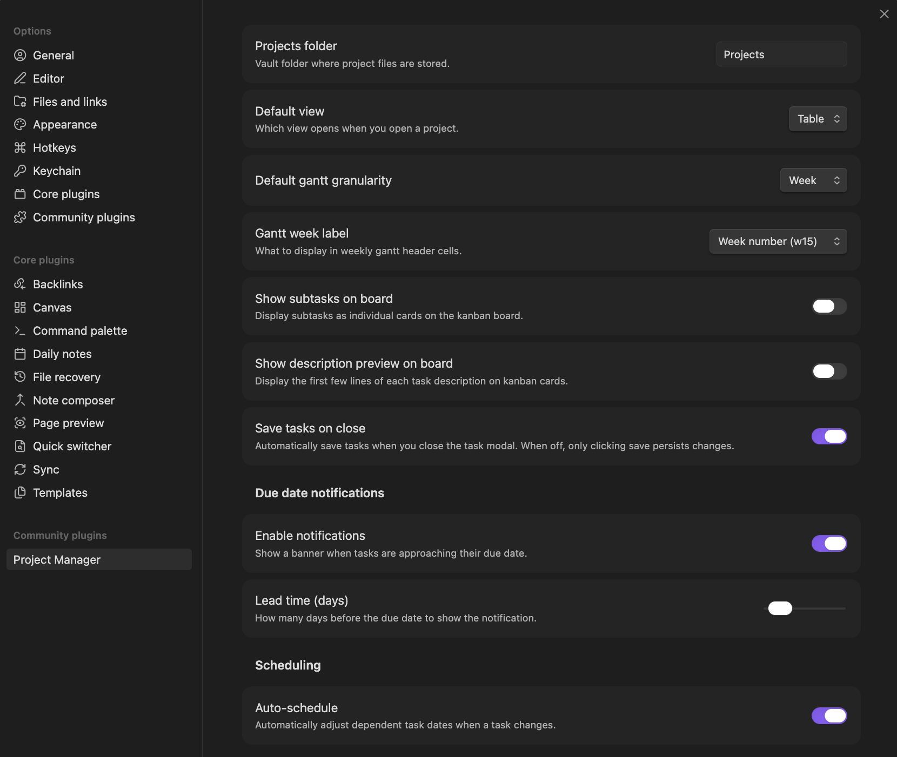

# Settings reference

Every setting in **Settings** → **Project Manager**, grouped the way the tab groups them. The defaults below match a fresh install.

Most of these are vault-wide defaults. A project can override the ones marked **overridable** in its own settings — see [Project overview and settings](/docs/project-overview).

## General

### New project folder

Where newly created top-level projects go.

- **Type:** folder picker
- **Default:** `Projects`

Leave it empty to create them in the vault root. It does *not* decide which projects the plugin shows — projects are discovered vault-wide, wherever their files live. Move a project folder anywhere and it stays in the list.

### Excluded folders

Folders the plugin skips when looking for projects and tasks.

- **Type:** list of folders
- **Default:** empty

Use it for template folders or archives that contain notes carrying `pm-project: true` you don't want picked up.

### Open projects in

Where a project link lands.

- **Type:** dropdown — Overview / Tasks
- **Default:** Overview

**Tasks** skips the overview page and goes straight to the table, timeline, or board.

### Default tasks view

Which view a project's tasks open in. **Overridable per project.**

- **Type:** dropdown — table / gantt / board
- **Default:** table

### Open tasks in

Where a task opens for editing.

- **Type:** dropdown — Modal / Tab
- **Default:** Modal

**Tab** also opens task notes in the task editor instead of Obsidian's markdown editor.

### Save tasks on close

Save changes when the task editor is closed.

- **Type:** toggle
- **Default:** on

Off means you must click **Save** (or press **Shift+Enter**) to commit. Closing without saving discards changes.

## Style

### Show tag colors

Give each tag a colored dot derived from its name.

- **Type:** toggle
- **Default:** on

### Priority icons

Icon set used for priorities that carry no icon of their own. **Overridable per project.**

- **Type:** dropdown — Chevrons / Signal bars / Arrows / Alerts / None
- **Default:** Chevrons

Icons are assigned by rank, highest priority first. A priority scale longer than the set leaves its lowest ranks without an icon.

## Table

### Show subtree connections

Draw lines tying a subtask row back to its parent. **Overridable per project.**

- **Type:** toggle
- **Default:** on

### Line borders

Rules drawn between rows, between columns, or both. **Overridable per project.**

- **Type:** dropdown — none / horizontal / vertical / both
- **Default:** none

## Gantt

### Default granularity

Time unit for each column in the timeline.

- **Type:** dropdown — day / week / month / quarter / year
- **Default:** week

### Week label

Text shown in weekly header cells.

- **Type:** dropdown
  - **Week number** — "w15"
  - **Date range** — "apr 7–13"
  - **Both** — "w15: apr 7–13"
- **Default:** week number

## Board

### Show subtasks

Display subtasks as individual cards. **Overridable per project.**

- **Type:** toggle
- **Default:** off

When off, only top-level tasks appear on the board and subtask progress feeds a badge on the parent card.

### Show description preview

Display the first few lines of each task description on its card. **Overridable per project.**

- **Type:** toggle
- **Default:** off

## Scheduling

### Auto-schedule

Adjust dependent task dates when a task changes. **Overridable per project.**

- **Type:** toggle
- **Default:** on

See [Subtasks and dependencies](07-subtasks-and-dependencies.md) for the full rules. In short: dates only move forward, and only along outgoing dependency edges from the task you changed. Archived predecessors and complete statuses are skipped.

### Pull dependents forward

Move dependent tasks earlier when a task is completed before its due date. **Overridable per project.**

- **Type:** toggle
- **Default:** off

The one case where auto-schedule moves a date backwards, and it's opt-in.

## Archive

### Auto-archive completed tasks

Move completed tasks to the project's archive after this many days. **Overridable per project.**

- **Type:** dropdown — 0 (off) / 7 / 14 / 30 / 90 days
- **Default:** 0 (off)

The sweep runs at most once a day. A subtree moves as a unit, so one unfinished descendant keeps the whole branch in place, and a task with no completion date is never swept. A task something unarchived still depends on waits until its dependents go too. **Archive completed tasks** runs the same sweep on demand.

## Notifications

### Due date reminders

Show a banner when a task is approaching its due date.

- **Type:** toggle
- **Default:** on

Suppressed for tasks in a status marked complete, and for archived tasks.

### Days in advance

How many days before the due date to notify.

- **Type:** slider
- **Default:** 2

## Task fields

Three sub-pages.

### Statuses

The vault's status list. For each: **label**, **color** (badges and board column headers), an optional **icon**, and a **complete** flag marking it a terminal state.

Reorder by dragging — the order here is the board's column order and the table's status sort. Add with **+ add status**. Delete with the trash icon.

Ships with: To Do, In Progress, Blocked, In Review, Done (complete), Cancelled (complete).

Projects can run their own status list instead — see [Statuses and priorities](06-statuses-and-priorities.md).

### Priorities

Same shape: **label**, **color**, optional **icon**, reorderable. Order is rank, highest first — it drives both sort order and which icon each priority gets from the icon set.

Ships with: Critical, High, Medium, Low.

### Custom fields

Extra task properties available across **all** projects. Each has a name, a type, an optional icon, and options for select and multi-select types.

Fields defined here reach every project in the vault. A project can hide one, rename it, or retype it locally, and can define fields of its own on top. See [Custom fields](08-custom-fields.md).

## Integrations

### TaskNotes

Appears only when the TaskNotes plugin is installed. Copies statuses and priorities across from TaskNotes 4.10 or newer. See [TaskNotes integration](/docs/tasknotes).

## Team members

A page of its own, with two settings.

### People folder

Where person notes are looked for and created.

- **Type:** folder picker
- **Default:** `People`

Leave it empty to search the whole vault.

### Team members

People offered as assignees and members in every project.

- **Type:** list of people
- **Default:** empty

Per-project members sit on top of this list rather than replacing it. There's no user system and no permissions — assignees are people you can filter on and click through to.

## Where to go next

- [Project overview and settings](/docs/project-overview) — what a single project can override.
- [Statuses and priorities](06-statuses-and-priorities.md) — the workflow side of the status and priority editors.
- [Subtasks and dependencies](07-subtasks-and-dependencies.md) — the rules behind auto-schedule.
