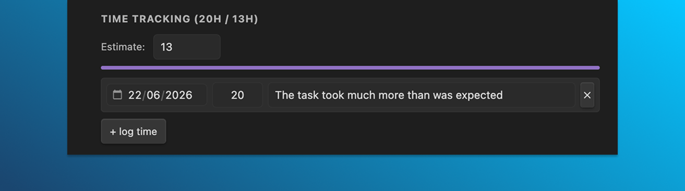
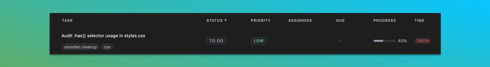

# Time tracking

Log hours against tasks. Set an estimate, compare actual vs. planned, and see totals in the table view's **time** column.



## The time tracking panel

Open any task. The **time tracking** panel sits below the standard fields. The panel is hidden for milestone-type tasks (which don't have duration).

The panel header shows totals — `Time tracking (2h / 10h)` means 2 hours logged against a 10-hour estimate.

## Set an estimate

In the panel, set **estimate (hours)**. Step is 0.5 hours; minimum 0.

If an estimate is set, a progress bar shows logged ÷ estimate. The bar turns red if you exceed the estimate.

The estimate is optional — leave it at 0 (or unset) and the bar is hidden.

## Log time manually

Each log entry has three fields:

- **Date** (`YYYY-MM-DD`, defaults to today).
- **Hours** (number, step 0.25, min 0).
- **Note** (free-form text).

Click **+ log time** to add an entry. Each entry has a remove button on its right.

Logs save with the task — on **Save**, or on close if **save tasks on close** is on.

## Where time data lives on disk

The task's YAML includes a `timeLogs` array, omitted if empty:

```yaml
timeEstimate: 10
timeLogs:
  - date: "2026-05-22"
    hours: 1.5
    note: "First draft"
  - date: "2026-05-23"
    hours: 0.5
    note: "Edits after review"
```

Adding or editing entries by hand is fine — the plugin re-reads on file change.

## Totals in the table view

The **time** column in the table view shows the sum of `hours` across the task's `timeLogs`. It's display-only; not currently sortable.



## Where to go next

- [Data format](17-data-format.md) — `timeLogs` and `timeEstimate` in full.
- [Table view](09-table-view.md) — the time column.

## Tips

> Logging is manual — there's no auto-tracker. Trade-off: lower friction to set up, no background process, but you have to remember to log. Most people batch logs at the end of a session.

> Big estimates ("80h") tend to be wrong. If you find a task is heavily over its estimate, break it into subtasks with their own estimates. Rollups give you a more honest picture.
